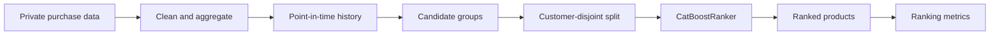

<div align="center">

# Enterprise Product Recommendation System

### Privacy-first, point-in-time product ranking with CatBoost

[](https://www.python.org/)
[](https://catboost.ai/)
[](#why-learning-to-rank)
[](#privacy-by-design)

Turn truthful customer-product history into a ranked list of products a customer is likely to purchase next.

</div>

---

## Overview

This repository contains a complete local recommendation baseline:

1. clean paid product purchases and remove gifts;
2. construct point-in-time customer-product history;
3. generate positive and negative ranking candidates;
4. keep every customer in exactly one data split;
5. train a configurable `CatBoostRanker`;
6. evaluate recommendation quality against random and purchase-history baselines.

The implementation is designed for a real business dataset without publishing row-level business data or identifiers. This repository includes one explicitly reviewed baseline model and aggregate evaluation artifacts.

## Why learning to rank?

A customer can purchase several products in one event. Predicting one class is therefore the wrong shape of problem.

For every customer scoring event, the pipeline creates a candidate group:

| Candidate | Meaning | Label |
|---|---|---:|
| Product purchased in this event | Positive example, including a first purchase | `1` |
| Product purchased earlier but not now | Truthful historical negative | `0` |
| Existing product never paid for by this customer | Sampled catalogue negative | `0` |

CatBoost receives the candidates and their historical features, then learns to put the positive candidates above the negative ones.



## Core guarantees

- **Truthful history** — every historical feature uses only events strictly before the scoring event.
- **Same customer, same product** — product-history statistics are never copied from another customer or product.
- **First purchases are retained** — a positive product does not need earlier purchase history.
- **Realistic negatives** — previously purchased products can correctly have `label = 0` when they were not purchased in the current event.
- **No identity memorization** — `customer_id` and `group_id` organize the data but never enter the model.
- **No target leakage** — current-event quantities and dates are excluded from training features.
- **Unseen-customer evaluation** — all records for one customer stay in one split.

## Pipeline

### 1. Clean purchases

[`notebooks/01_clean_purchases.ipynb`](notebooks/01_clean_purchases.ipynb) removes gifts and other non-purchase rows, then converts paid product sales into one customer-date-product record with a single `quantity` field.

### 2. Build ranking candidates

[`notebooks/02_build_historical_features.ipynb`](notebooks/02_build_historical_features.ipynb):

- sorts source events chronologically;
- creates one ranking group per customer purchase date;
- keeps all products actually paid for on that date as positives;
- samples products previously purchased by the same customer as hard negatives;
- targets 25 candidates per group, balancing hard historical negatives with real catalogue products never paid for by that customer;
- calculates customer-product, category, business-line, and global product-demand features strictly from prior history;
- removes target-day quantities and purchase dates from the final training table.

The scoring date is written to separate group metadata for validation and auditing. It is not a model input.

### 3. Train and evaluate

[`scripts/train_catboost.py`](scripts/train_catboost.py):

- validates the training and metadata contracts;
- creates deterministic `70 / 15 / 15` customer-disjoint splits;
- trains a CatBoost YetiRank model with early stopping;
- compares it with random and purchase-history baselines;
- exports metrics, feature importance, test predictions, and the model.

## Model contract

### Input

Each model row means:

> “Should this product rank highly for this customer at this scoring event, given only information available beforehand?”

| Feature family | Examples |
|---|---|
| Product identity | `product_id`, `product_category`, `business_line` |
| Purchase history | prior purchase count, cumulative purchased quantity, and last purchase quantity |
| Purchase timing | days since the last purchase, average reorder interval, and observed interval count |
| Replenishment timing | expected days before the next order for the last purchased quantity |
| Affinity | prior category and business-line purchase counts and shares |
| Product demand | lifetime product purchases and customers, plus recent 30-day purchase count |

`business_line` supplies a population-level signal for customers with little or no history. The historical business-line count and share add personalized signals once prior purchases exist.

The current purchase-only CatBoost model uses 17 inputs. It excludes gift/receipt-history fields and redundant boolean, median, interval-variability, customer-order-count, quantity-trend, and replenishment-progress fields, while retaining product context, reorder cadence, affinity depth, and point-in-time product popularity.

### Output

CatBoost outputs one numeric relevance score per candidate product. Products are sorted by that score inside the customer’s group:

```text
customer scoring group
├── Product A  score 2.41  → rank 1
├── Product C  score 1.76  → rank 2
└── Product B  score 0.93  → rank 3
```

The score is not a calibrated purchase probability. Its purpose is ordering candidates.

## Evaluation, without the jargon

Suppose the customer actually purchased `A` and `B`, while the model ranks:

```text
1. A  ✓
2. C  ✗
3. B  ✓
```

| Metric | Result | Question it answers |
|---|---:|---|
| HitRate@1 | `1.00` | Was at least one correct product first? |
| Precision@1 | `1.00` | Was the single first recommendation correct? |
| Recall@1 | `0.50` | How much of the two-product basket appeared in the first slot? |
| Precision@3 | `0.67` | What fraction of the first three recommendations was correct? |
| Recall@3 | `1.00` | How much of the purchased basket appeared in the first three slots? |
| MRR | `1.00` | How early did the first correct result appear? |
| NDCG@3 | `< 1.00` | Were all correct products placed as high as possible? |

The evaluator also reports:

- **catalogue coverage** — how much of the candidate catalogue is ever recommended;
- **first-purchase Recall@K** — recall for products the customer had never paid for before;
- **repeat-purchase Recall@K** — recall for purchased products with earlier paid history.

Metrics are always compared with simple baselines. A sophisticated model is useful only if it beats an understandable alternative.

## Quick start

### Requirements

- Python 3.12
- [`uv`](https://docs.astral.sh/uv/)
- the private source data in the expected local path

### Prepare the data

Run the notebooks in order:

```text
notebooks/01_clean_purchases.ipynb
notebooks/02_build_historical_features.ipynb
```

### Train

```bash
uv run --with-requirements requirements.txt \
  python scripts/train_catboost.py \
  --config configs/catboost_training.json
```

Hyperparameters, categorical features, excluded fields, split fractions, metric cutoffs, and output paths live in [`configs/catboost_training.json`](configs/catboost_training.json).

The default configuration is selected automatically, so this shorter command is equivalent:

```bash
uv run --with-requirements requirements.txt \
  python scripts/train_catboost.py
```

### Use the published baseline

```python
from catboost import CatBoostRanker

model = CatBoostRanker()
model.load_model("models/catboost_ranker.cbm")
```

The model expects the 17-feature purchase-only subset selected in the training configuration from the schema created by the candidate-building notebook. It returns relative ranking scores, not calibrated purchase probabilities.

## Repository layout

```text
.
├── configs/
│   └── catboost_training.json       # Model, split, feature, and output settings
├── notebooks/
│   ├── 01_clean_purchases.ipynb     # Private-data cleaning
│   └── 02_build_historical_features.ipynb
├── models/
│   └── catboost_ranker.cbm           # Reviewed CatBoost baseline
├── artifacts/
│   └── catboost/
│       ├── metrics.json              # Aggregate evaluation results
│       └── feature_importance.csv    # Aggregate feature importance
├── scripts/
│   └── train_catboost.py            # Reproducible training and evaluation
├── requirements.txt        # Pinned training dependencies
└── README.md
```

Confidential and row-level outputs remain local and ignored:

```text
data/
artifacts/catboost/test_predictions.csv
artifacts/reports/
```

## Privacy by design

The business dataset is confidential. This public repository intentionally excludes:

- raw and cleaned sales records;
- customer and product identifier values;
- product catalogues derived from company data;
- intermediate feature tables and row-level predictions;
- confidential project reports;
- executed notebook outputs.

Tracked notebooks contain source code only. The published model, aggregate metrics, and aggregate feature importance were included by explicit approval after a check for embedded raw identifiers and local file paths. A trained model still represents patterns learned from confidential data, so publishing future model versions should receive the same review. Public tests and examples should use synthetic data.

## Current limitations

- Candidate groups contain at least 25 sampled products and remain smaller than the production catalogue.
- Offline quality still depends on whether production candidate retrieval supplies similarly difficult and relevant products.
- Repeat-purchase ranking should be evaluated separately from first-purchase discovery.
- A future production evaluation should use the exact candidate-generation policy used at inference time.

## Roadmap

- [x] Privacy-safe cleaning pipeline
- [x] Point-in-time customer-product features
- [x] Truthful positive and negative candidates
- [x] Customer-disjoint CatBoost ranking baseline
- [x] Ranking metrics and simple baselines
- [ ] Synthetic-data regression tests
- [ ] Production-scale candidate retrieval
- [ ] Probability calibration and serving interface
- [ ] Monitoring for drift, coverage, and recommendation quality

---

<div align="center">

Built as a transparent recommendation baseline: correct history first, model complexity second.

</div>
