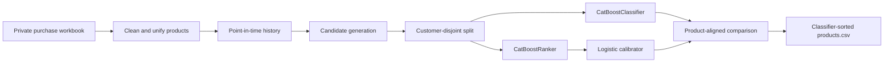

<div align="center">

# Enterprise Product Recommendation System

### Point-in-time recommendations, calibrated probabilities, and explainable model comparison

[](https://www.python.org/)
[](https://catboost.ai/)
[](https://pandas.pydata.org/)
[](#model-lab)
[](#evaluation)
[](#privacy-by-design)

An end-to-end recommendation pipeline that turns private purchase history into a ranked product list, compares two CatBoost strategies, and exposes the result through one product-aligned serving table.

**Classifier probabilities · Learning-to-rank baseline · Point-in-time features · First/repeat purchase evaluation**

</div>

---

## At a glance

| Capability | Implementation |
|---|---|
| Business problem | Recommend the products a customer is most likely to purchase next |
| Data preparation | Product cleaning, package-volume unification, receipt aggregation |
| Feature design | Strictly prior customer-product history, cadence, affinity, and demand |
| Main experiment | `CatBoostClassifier` with direct purchase probabilities |
| Comparison model | `CatBoostRanker` with a legacy logistic probability calibrator |
| Validation | Customer-disjoint train, validation, and test splits |
| Serving output | One classifier-sorted table containing both models' scores |
| Privacy | Raw data, row-level predictions, and customer-specific outputs stay local |

## Why this project matters

Real recommendation systems are not just model-training scripts. They must keep historical features leakage-safe, construct truthful negatives, handle products never purchased before, reproduce training transformations during inference, and make competing model outputs comparable at the product level.

This project implements that complete path:



## Verified results

The current experiment uses 17 model features and evaluates unseen customers. The test split contains 371 customers, 4,247 ranking groups, 106,175 candidate rows, and zero customer overlap with training or validation.

### Recommendation quality

| Test metric | CatBoostClassifier | CatBoostRanker | Better |
|---|---:|---:|---|
| MRR | 0.6363 | **0.6415** | Ranker |
| Hit Rate@1 | 47.96% | **48.58%** | Ranker |
| Recall@5 | 77.64% | **77.96%** | Ranker |
| Recall@10 | 93.07% | **93.17%** | Ranker |
| NDCG@10 | 0.6909 | **0.6952** | Ranker |
| First-purchase Recall@10 | 81.04% | **82.27%** | Ranker |
| Repeat-purchase Recall@10 | **96.04%** | 95.72% | Classifier |
| Catalogue Coverage@10 | 86.03% | **91.48%** | Ranker |

The classifier is close to the ranker and slightly stronger for repeat-purchase recall at 10, but the ranker remains the stronger pure-ranking model overall.

### Classifier probability quality

| Test metric | Value |
|---|---:|
| ROC AUC | **0.9017** |
| Log loss | **0.1563** |
| Brier score | **0.0447** |
| Expected calibration error | **0.0019** |
| Mean predicted probability | 6.43% |
| Observed positive rate | 6.31% |

These probabilities are conditional on the candidate-generation policy used during training. They should not be interpreted as unconditional purchase probabilities across the entire catalogue.

## Model lab

### CatBoostClassifier

The classifier treats every customer-product candidate as a binary decision:

> Given only information available before the scoring date, will this customer purchase this product in the current event?

It optimizes `Logloss`, returns `predict_proba()[:, 1]`, and supplies the primary sort order in the serving pipeline.

### CatBoostRanker + logistic regression

The preserved ranker uses the same 17 features but optimizes `YetiRank` inside customer scoring groups. A logistic-regression model converts ranker diagnostics into a displayed probability.

The legacy calibrator is retained for comparison and was fitted on the old test-prediction artifact. Its probabilities are useful for inspecting the former serving behavior, but they are not an independent test of calibration.

### What the live comparisons show

Five deterministic usage-pipeline runs across customers with light through heavy histories produced:

| Comparison | Observed result |
|---|---:|
| Same top product | 3 of 5 runs |
| Mean overlap in top five | 4.4 of 5 products |
| Classifier correlation with historical score | 0.483 Spearman |
| Ranker correlation with historical score | 0.518 Spearman |

The ranker is slightly more conservative and history-aligned. The classifier is slightly more responsive to overdue reorder timing and recent product demand. Both approaches consistently prioritize repeat products in the current serving candidate policy.

## One product-aligned comparison table

The usage pipeline writes a single local file:

```text
deployment_pipeline/data/products.csv
```

Each row represents exactly one product. Both models score the same candidate row before the classifier top 20 is selected, preventing positional joins or scores being attached to the wrong product.

```text
product identity
→ customer-product history
→ category and business-line affinity
→ catalogue demand
→ expected_days_before_next_order
→ historical_score
→ classifier_score
→ classifier_rank
→ ranker_score and diagnostics
→ ranker_rank
→ ranker_logistic_probability
```

`expected_days_before_next_order` is deliberately the final feature column. Every column after it is a model score, diagnostic, or rank. Rows are sorted by `classifier_score` descending.

## Feature engineering

| Feature family | Examples |
|---|---|
| Product context | `product_id`, `product_category`, `business_line` |
| Purchase depth | prior purchase count, cumulative quantity, last quantity |
| Recency | days since the last paid purchase |
| Reorder cadence | average and variability of prior purchase intervals |
| Replenishment | expected days before the next order |
| Customer affinity | prior category and business-line counts and shares |
| Product demand | lifetime purchases, unique customers, recent 30-day purchases |

### Leakage controls

- Every historical feature uses information available at or before the scoring boundary.
- Customer and group identifiers organize examples but never enter the model.
- Current-event quantities and outcomes do not enter the feature set.
- First purchases remain valid positive labels.
- Products purchased previously can be truthful negatives when not purchased in the current event.
- Customers never overlap across train, validation, and test.

### Product unification

Package variants such as `1 L`, `2 L`, `500 ml`, and Cyrillic unit equivalents are grouped by normalized base name. The smallest package becomes canonical, larger packages are converted into canonical-unit quantities, and product identity is remapped consistently in both training and usage pipelines.

## Repository structure

```text
.
├── configs/
│   └── catboost_training.json
├── deployment_pipeline/
│   └── usage_pipeline.py
├── notebooks/
│   ├── 01_clean_purchases.ipynb
│   └── 02_build_historical_features.ipynb
├── scripts/
│   └── train_catboost.py
├── models/
│   ├── catboost_classifier.cbm
│   ├── catboost_ranker.cbm
│   └── purchase_probability_calibrator.joblib
├── artifacts/
│   ├── catboost/
│   └── catboost_classifier/
├── requirements.txt
└── README.md
```

## Run locally

### Requirements

- Python 3.12
- [`uv`](https://docs.astral.sh/uv/)
- The private source workbook in `data/raw/`

### 1. Prepare the data

Run the notebooks in order:

```text
notebooks/01_clean_purchases.ipynb
notebooks/02_build_historical_features.ipynb
```

### 2. Train the classifier

```bash
uv run --with-requirements requirements.txt \
  python scripts/train_catboost.py \
  --config configs/catboost_training.json
```

### 3. Compare both serving approaches

```bash
uv run --with-requirements requirements.txt \
  python deployment_pipeline/usage_pipeline.py [customer_id]
```

When `customer_id` is omitted, the script chooses a known customer. The customer-specific comparison is saved locally to `deployment_pipeline/data/products.csv`.

## Evaluation

Recommendation quality is measured at K = 1, 3, 5, and 10 using:

- **Hit Rate** — whether at least one relevant product appears in the top K;
- **Precision** — how much of the recommendation list is relevant;
- **Recall** — how much of the purchased basket is recovered;
- **MRR** — how early the first relevant product appears;
- **NDCG** — whether relevant products are ordered near the top;
- **Catalogue coverage** — how broadly the model recommends across products;
- **First/repeat recall** — discovery and replenishment performance separately.

Classifier probabilities are evaluated with log loss, Brier score, ROC AUC, and expected calibration error.

## Privacy by design

The following stay local and are excluded from publication:

- raw and cleaned purchase records;
- customer and product-level training tables;
- private workbooks and generated customer tables;
- row-level test predictions;
- executed notebook outputs.

Only explicitly reviewed code, model artifacts, aggregate metrics, and aggregate feature importance are published. Trained models still encode patterns learned from confidential data and should receive the same review before every release.

## Limitations and next steps

- Candidate groups are much smaller than the full production catalogue.
- Offline quality depends on production candidate retrieval matching evaluation conditions.
- Classifier probabilities are conditional on sampled candidates.
- The legacy logistic calibrator does not have an untouched calibration test.
- Current live comparisons describe model behavior but do not contain future purchase outcomes.
- Production monitoring for drift, coverage, calibration, and realized conversion remains future work.

## Resume-ready summary

> Built an end-to-end enterprise product recommendation system using leakage-safe point-in-time features, customer-disjoint evaluation, CatBoost classification and learning-to-rank models, calibrated probability analysis, product-variant unification, and a shared inference pipeline; achieved 93.1% Recall@10 and 0.902 ROC AUC on held-out customers.

<div align="center">

---

**A recommendation system is only trustworthy when its history, candidates, evaluation, and serving path all mean the same thing.**

</div>
